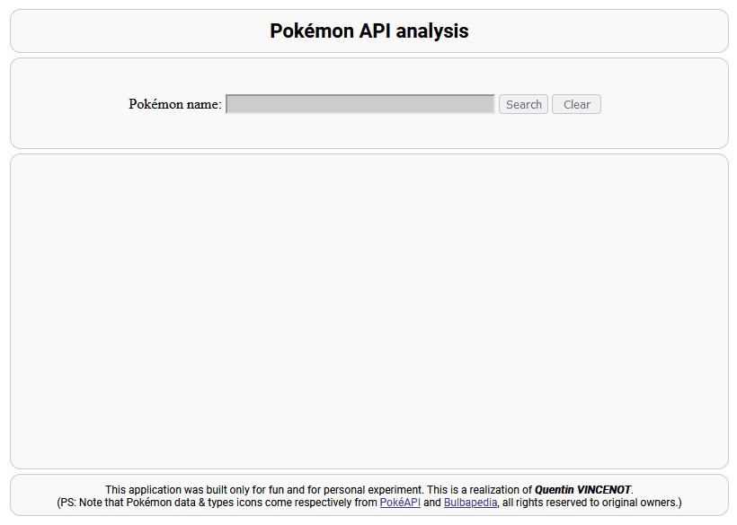

# Pokémon API analysis

This personal project tries to retrieve Pokémon data from an online free API service, and visualize the results in a HTML/CSS webpage with simple Javascript dynamics. As a big fan of the franchise, this is a completely personal project, designed for fun, only to showcase a simple application about Pokémon.

The various sources used to produce this project were the following :
- [PokéAPI.co](https://pokeapi.co/) for data retrieval
- [Bulbapédia](https://bulbapedia.bulbagarden.net/wiki/Type) for types images

The application is published thanks to Github Pages and is available at this address :
[Pokémon API Application](https://quentinvincenot.github.io/pokemon-api-analysis/)

You can find under a handmade GIF of the resulting application and website :

